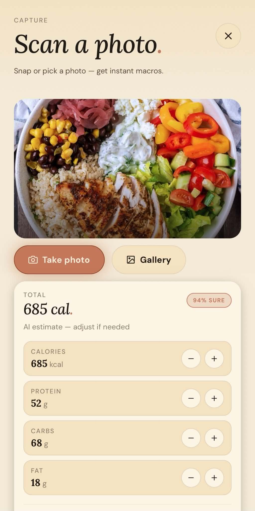
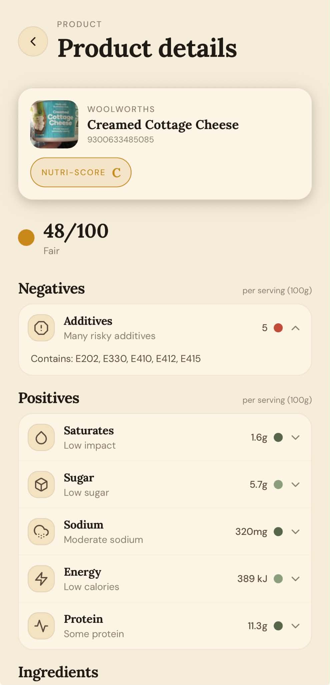
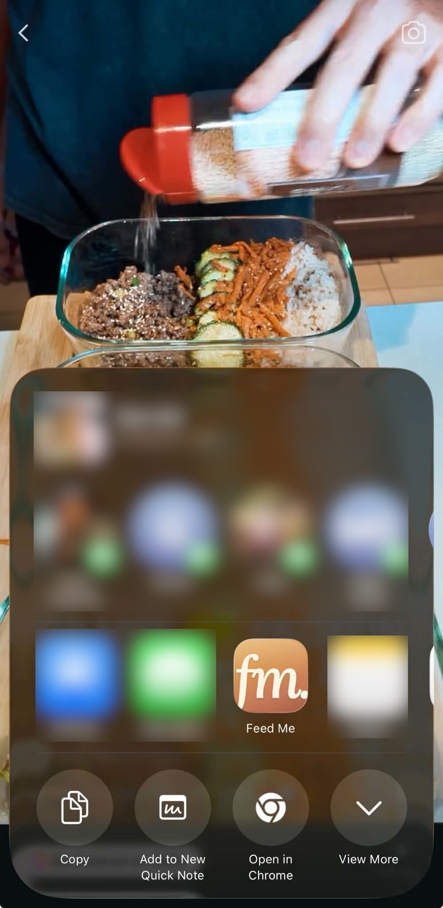
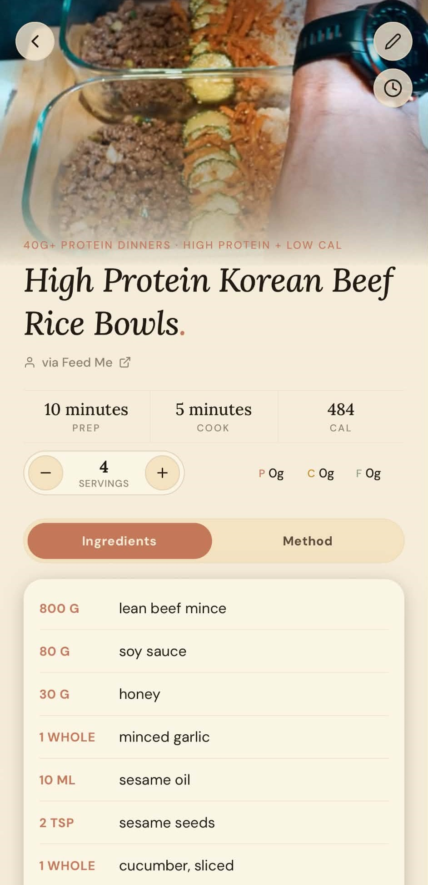
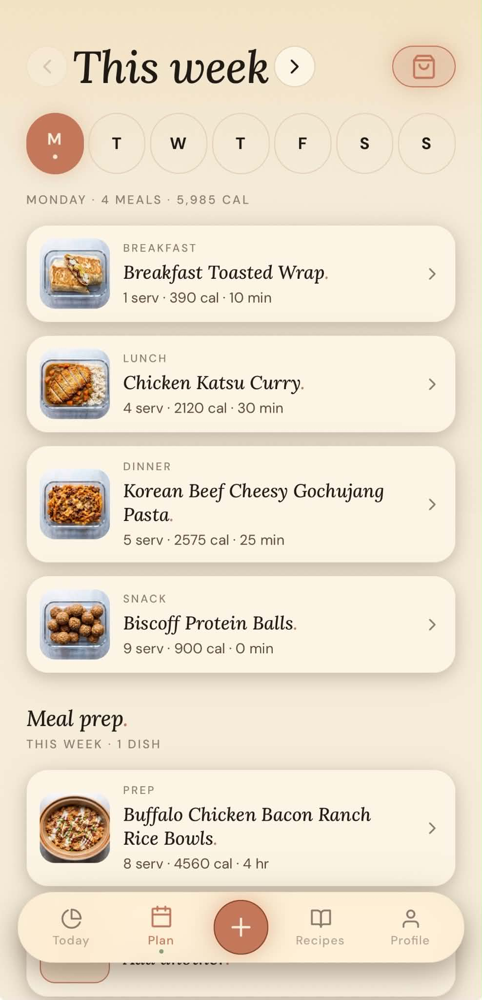

# How to use Feed Me

Welcome to Feed Me 👋 — your warm little kitchen companion for planning meals,
tracking what you eat, building a shopping list, and saving recipes from anywhere.

This guide walks you through everything, step by step. You don't need to read it
all — jump to whatever you're trying to do.

---

## Getting around

Feed Me has five tabs along the bottom:

- **Today** — your daily food diary and calorie/macro tracker.
- **Plan** — plan meals for the week ahead.
- **Scan** (the round button in the middle) — the quickest way to log food or add a recipe.
- **Recipes** — browse the recipe library and your own saved recipes.
- **Profile** — your details, preferences, and settings.

When you first sign up, Feed Me asks you a few quick questions (your goal, a bit
about you, how you like to cook, any dietary preferences) and builds a personalised
plan with daily targets. You only do this once.

---

## Today — your daily food diary

The **Today** tab is where you keep an eye on what you've eaten.

### The calorie ring

The big ring shows the calories you've eaten so far against your daily target —
for example **1,750 / 2,000**. Underneath it tells you how many you have **left**
(or how many you're **over**). If you've connected Apple Health, calories you burn
through exercise can be added on top (see *Apple Health* below).

Three bars below the ring track your **protein**, **carbs**, and **fat** for the
day against your targets. Don't worry if those words are new:

- **Protein** helps build and repair your body.
- **Carbs** are your main energy source.
- **Fat** keeps you full and supports your body.

### Logging your food

There are four quick ways to log a meal — tap any of the buttons on Today, or use
the **Scan** tab:

1. **Describe** — type what you ate (e.g. *"2 eggs on toast with butter"*). Pick a
   match from the list, or let Feed Me estimate it for you.
2. **Photo** — snap or choose a photo of your plate and Feed Me estimates the
   calories and macros.
3. **Barcode** — scan a packaged product's barcode to pull in its nutrition.
4. **Library** — log something from your saved recipes.

Everything you log appears in your day, and the ring and bars update straight away.
Tap the big card on Today to see the full day and add or remove entries.

### Your weight

Tap the **weight card** to log today's weigh-in. Feed Me shows your 7-day average
and the trend over time, so day-to-day wobbles don't worry you. Tap **Trends** (or
press and hold the card) to see your charts.

### History and trends

Tap the Today card to open the full day, then use the **Analytics / Trends** screen
to look back over the last week, month, or longer. You'll see your average calories,
weight change, and how many days you logged. Tap any day to see exactly what you ate.

### Your daily targets

Your targets (calories, protein, carbs, fat) are worked out automatically from your
goal and details. To change them, go to **Profile → Nutrition targets**:

- **Calculated** — Feed Me does the maths from your stats and goal. Tap any stat to
  update it.
- **Custom** — set your own numbers if you've been given specific guidance.

Tap **Save targets** when you're done.

### Home-screen widgets

Add a Feed Me widget to your phone's home screen for an at-a-glance look:

- **Today's Plate** — your calorie ring and how much you have left.
- **On the Menu** — what's planned to eat today.

---

## Scan — log food & add recipes fast

The **Scan** tab (the middle button) gathers every quick action in one place.

*Snap your plate and we estimate the calories and macros.*

*Scan a barcode for its Nutri-Score, additives, and a health verdict.*

### Log what you ate

- **Describe Meal** — type your meal; pick a common food or tap **Estimate with AI**.
  The *Recent* and *Favourites* tabs let you re-log things in a tap.
- **Scan Photo** — **Take photo** or pick from **Gallery**; Feed Me estimates the
  nutrition. Edit the servings or numbers, then **Log to today**.
- **Scan Barcode** — point your camera at a product barcode. You'll see the product,
  its nutrition, and a health verdict against your targets.

### Add a recipe

- **Suggest a Recipe** — tell Feed Me a **Meal idea** (e.g. *"a high-protein
  chicken rice bowl"*), or choose **Use what I have** and list your ingredients.
  Feed Me writes a full recipe you can save.
- **Import Recipe** — paste a link from a recipe website, TikTok, Instagram or
  Facebook, or paste the recipe text. Feed Me reads it (it can even listen to a
  cooking video) and pulls out the ingredients, steps, and nutrition.
  **Tip:** you can also tap **Share** in TikTok/Instagram/your browser and choose
  **Feed Me** — the import starts automatically.
- **Create Recipe Manually** — type your own recipe (title, servings, cook time,
  ingredients one per line, and the method).

### Check products in-store

- **Scan Product** — scan a barcode while shopping to see its nutrition and a
  health verdict, without logging it.
- **Scan History** — everything you've scanned in-store, ready to re-open.

### A note on free vs Pro

The camera, barcode, manual entry, planning, and shopping list are always free.
The **AI** features come with a free weekly allowance for everyone that resets
every Monday — **5 photo scans, 5 "Describe Meal" estimates, 3 recipe imports**
(shared across links, social, and screenshots) and **2 AI suggestions** each week.
After that they're part of **Feed Me Pro** — see *Feed Me Pro* below. You'll need
to be signed in to a Feed Me account to use the AI features. AI estimates are a
helpful guide, not medical advice, so always check labels if you have allergies.

---

## Recipes & cookbooks

The **Recipes** tab has two parts:

- **Discover** — a big library of recipes. Use the **search** (magnifying glass) to
  find something by name or ingredient, and the **filter** (sliders) to pick a
  category. If you set a dietary preference, Discover automatically shows recipes
  that fit.
- **Cookbooks** — your own saved recipes, organised into collections.

Free members see a selection of the library; **Pro** unlocks all of it (locked
recipes show a small padlock).

### Opening a recipe

Tap any recipe to open it. You'll see a photo, the ingredients and the method (on
two tabs), and the calories and macros. A few handy things:

- **Servings** — tap **+ / −** to change how many you're cooking for; the ingredient
  amounts update automatically.
- **Timer** — tap the clock to start a cooking timer that keeps running as you scroll.
- **Save** — tap the bookmark to save a Discover recipe to your own collection.
- **Add to my week** — drop the recipe straight into your meal plan.

### Your own recipes & cookbooks

- **Save** recipes from Discover, **import** them from the web/social, **ask AI** to
  suggest them, or **create** your own — they all land in your Cookbooks.
- Feed Me organises them automatically (e.g. *Social*, *AI Suggestions*, *My
  Recipes*, *Recently Added*), and you can make your own cookbooks too — tap
  **+ New cookbook**, then add recipes with the book icon on any recipe.
- To **edit** one of your recipes, open it and tap the pencil. To **delete**, swipe
  a recipe in the list view and confirm.

*Paste a link, or share from TikTok, Instagram or the web…*

*…and we pull out the ingredients, steps, and nutrition.*

---

## Plan — map out your week

The **Plan** tab lays your week out by day, with **Breakfast, Lunch, Dinner** and
**Snack** slots.

*Drag recipes into days — servings scale and ingredients merge.*

### Adding meals

1. Tap an empty slot (**Pick a meal**), or open any recipe and tap **Add to my week**.
2. Choose the **day** and the **meal** (a slot that's already filled shows a padlock).
3. Adjust servings first if you like — the totals update to match.

Tap the day letters (**M T W…**) to jump between days; the chevrons at the top move
between **this week** and **next week**. To remove a meal, **swipe it** and tap
**Remove**.

There's also a **Meal prep** section for batch-cook dishes you want ready for the week.

---

## Shopping list

Your shopping list builds itself from the meals you've planned. Open it with the
**shopping-bag** button on the Plan tab.

- It's grouped by aisle (Produce, Dairy, Proteins…), and **identical ingredients are
  added together** so you don't get duplicates.
- Choose **Day**, **Week**, or **Next week** at the top to change what it covers.
- **Tap an item** to tick it off as you shop.
- Type in the **"Add an item…"** box to add anything extra (like dish soap).
- **Swipe** an item to remove it.
- Tap **share** to send or save the list as text.

If you haven't planned any meals yet, the list will be empty — plan a few meals
first, or just jot items in the box.

---

## Make it yours — Profile & settings

Open the **Profile** tab to adjust anything:

- **About you** — your name, date of birth, sex, height, weight, activity level, and
  goal. Changing these updates your targets.
- **Units** — metric or imperial, set separately for your body stats and for recipes.
- **Dietary preference** — None, Vegetarian, Vegan, or Pescatarian. Filters recipes
  and your shopping list.
- **Notifications** — gentle, optional reminders: tonight's meal, calorie check-in,
  morning weigh-in, weekly meal prep, and new featured recipes. Tap one to set its
  time, or switch it off.
- **Appearance** — switch between **Light** and **Dark**, choose a colour theme, and
  pick a font.
- **Apple Health** (iPhone) — sync your logged meals to Apple Health, and optionally
  add the calories you burn through exercise to your daily budget. You choose how
  much to add and whether to cap it.
- **Export meals** (Pro) — download your food diary as a PDF or spreadsheet.
- **Sign out** / **Delete account** — deleting is permanent and asks you to type a
  confirmation phrase first; it can't be undone.

### Apple Health, a little more

When you connect Apple Health, Feed Me **writes** the meals you log into the Health
app, and can **read** your active energy and steps to keep your calorie ring
accurate. You're always in control — turn it off any time in **iOS Settings → Health
→ Data Access & Devices**.

---

## Feed Me Pro

Most of Feed Me is free forever — the planner, shopping list, tracker, themes, and
reminders. **Feed Me Pro** adds:

- The **full recipe library**
- **Unlimited** AI food scans (photo & describe)
- **Unlimited** recipe imports (links, social, paste)
- **Unlimited** AI recipe suggestions
- **Meal export** (PDF/CSV)

Everyone gets a free weekly allowance of the AI features that resets every Monday;
once you've used the week's allowance, you'll be invited to upgrade (or you can
wait for the reset).

### Trial & plans

- A **free trial** lets you try every Pro feature with nothing charged today.
- Choose **Monthly** or **Annual** — both unlock the same features; Annual is the
  better value per month.
- If you'd rather not, tap **Maybe later** — you can upgrade any time from the
  Profile tab.
- Already subscribed on another device? Tap **Restore** on the paywall.
- Manage or cancel anytime via **Profile → Manage subscription** (this opens the App
  Store or Google Play, which handle billing).

### Invite friends & redeem codes

- **Invite friends** — paying Pro members can share a referral code. A friend who
  redeems it gets a **7-day free Pro trial**. You get a fresh code for the next friend.
- **Redeem a code** — got a code? Enter it under **Profile → Redeem a code** to start
  your own free Pro trial. One per account.

---

## Tips & common questions

- **New to tracking?** Just log a meal or two a day to start — it gets quicker as the
  app learns your favourites.
- **Made a mistake?** Open the day from Today and remove the entry; swipe to remove
  planned meals or shopping items.
- **Offline?** You can still browse what's loaded; changes sync when you're back online.
- **AI looks off?** It's an estimate — tap to adjust the numbers before you log, and
  always check packaging for allergens.
- **Need a hand?** Email us any time at **support@envyapplications.com** — we read
  every message.

Happy cooking 🍲
